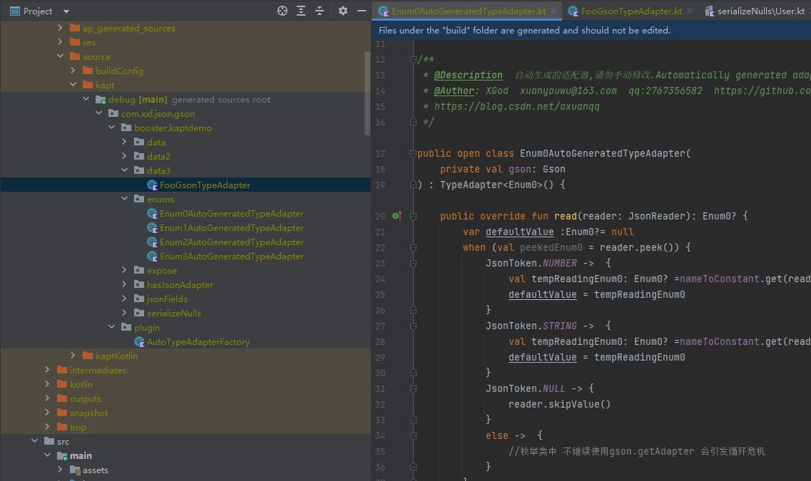
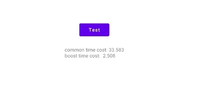

# gson_plugin
gson_plugin是一个注解处理器，能够在编译期自动生成**兼容Kotlin特性的**、**高性能TypeAdapter**，以提升Gson的序列化与反序列化时间性能。同时也解决了kotlin默认值的问题.平均**比原始Gson快10倍**。
## 主要方向
1. 编译构建对象,零反射
2. 按需加载,json和声明字段的最小集合,包括expose.xx=false 和transient 修饰符
3. 减少类型判断和中间层遍历(Factory,Excluder)
4. 编译生成注解配置,减少运行时注解 @Expose SerializedName

## 框架特性
1. 目前测试支持kotlin 最高版本1.7.20
2. 支持gson和Moshi生成的adapter冲突
3. 支持gson自定义基本类型解析被阻断无效的场景(比如自定义BoolTypeAdapter)
4. 支持嵌套内部类,嵌套内部类名字用下划线隔离,避免不同类的嵌套类名字冲突
5. 支持别名  @SerializedName("age", alternate = ["age_int","AGE"])
6. 支持Number类及子类
7. 支持枚举类自动生成TypeAdapter @JsonModel (目前仅限kapt ksp还没完成)
8. 支持枚举序列化为String,Int,Long等类型(gson 默认会序列化成字符串类型 比如"1" 而不是1)
9. 自动生成的适配器 支持继承,业务可以继承了 然后再塞给gson
10. 支持字段用gson的注解声明@JsonAdapter 共存,如果有注解,优先用注解的适配器
11. 支持@Expose注解 来标记是否参与序列化和反序列化
12. 支持@JsonField 精细化控制声明的字段,优先级高于@JsonModel
13. 支持 饿汉式全部加载TypeAdapters
14. 支持枚举设置默认值 避免运行时异常(如果kotlin 声明为可空变量,将不影响,语言层转成java 用if判空了的)
15. [即将支持] 模型参数没有默认值的情况 (目前必须写默认值, 可以是?=null的形式)



### 注解解释
```kotlin
annotation class JsonModel(
    /**
     * 是否是空安全 默认true
     *
     * 如,对于int类型的声明
     * 如果是val i:Int? 将不受任何影响
     * 如果是val i:Int json里面是null 那么设置为false 将会报错,否则将会跳过这个字段
     *
     * 受影响范围 [INT, LONG, FLOAT, DOUBLE, STRING, BOOLEAN,ENUM]
     */
    val nullSafe: Boolean = true,
    /**
     * 是否强类型匹配 默认false
     *
     * 如,对于int类型的声明
     *如果是val i:Int? 将不受任何影响
     * 如果是val i:Int json里面是"" 那么设置为true 将会报错,否则继续调用gson.getAdapter 继续责任链解析(交给gson自带的或者registerTypeAdapter等来解析)
     *
     * 受影响范围 [INT, LONG, FLOAT, DOUBLE, STRING, BOOLEAN,ENUM]
     */
    val strictType: Boolean = false,

    /**
     * 生成的adapter文件 后缀名字 默认“AutoGeneratedTypeAdapter”
     */
    val adapterNameSuffix: String = "AutoGeneratedTypeAdapter",

    /**
     * 序列化最终数据类型 默认 SerializedType.STRING
     * Gson对于枚举默认序列化成String类型
     *
     * 受影响范围[ ENUM_CLASS ]
     */
    val serializedType: SerializedType = SerializedType.STRING,

    /**
     * 反序列化的默认值,
     * 如果枚举没有声明成可空类型,那么运行时将会导致bug,还有服务器可能增加枚举,那么老版本的app将会解析为null
     * 比如
     * @JsonModel(deserializedDefaultValue="undefined")
     * enum class Enum1 {
     *     @SerializedName("undefined")
     *     UNDEFINED,
     *     @SerializedName("x")
     *     A,
     *     @SerializedName("2")
     *     B
     * }
     * 那么 默认值 可以是 “undefined" 或者 ”UNDEFINED"
     *
     * 受影响范围[ ENUM_CLASS ]
     */
    val deserializedDefaultValue: String = ""
)


/**
 * 配合注解[com.xxf.json.gson.booster.annotation.JsonModel] 用于控制自动生成的Adapter逻辑
 */
annotation class JsonField(
    /**
     * 是否归属自动生成的TypeAdapter
     * 否则将会用gson自带的adapter来解析
     */
    val attached: Boolean = true,
    /**
     * 是否是空安全 默认true
     *
     * 如,对于int类型的声明
     * 如果是val i:Int? 将不受任何影响
     * 如果是val i:Int json里面是null 那么设置为false 将会报错,否则将会跳过这个字段
     *
     * 受影响范围 [INT, LONG, FLOAT, DOUBLE, STRING, BOOLEAN,ENUM]
     */
    val nullSafe: Boolean = true,
    /**
     * 是否强类型匹配 默认false
     *
     * 如,对于int类型的声明
     * 如果是val i:Int? 将不受任何影响
     * 如果是val i:Int json里面是"" 那么设置为true 将会报错,否则继续调用gson.getAdapter 继续责任链解析(交给gson自带的或者registerTypeAdapter等来解析)
     *
     * 受影响范围 [INT, LONG, FLOAT, DOUBLE, STRING, BOOLEAN,ENUM]
     */
    val strictType: Boolean = false
)
```
### 仓库权限
```groovy
//请在build.gradle中配置
allprojects {
    repositories {

        maven {
            url 'https://maven.aliyun.com/repository/public'
        }
        maven {
            credentials {
                username '654f4d888f25556ebb4ed790'
                password 'OsVOuR6WZFK='
            }
            url 'https://packages.aliyun.com/maven/repository/2433389-release-RMv0jP/'
        }
        maven {
            credentials {
                username '654f4d888f25556ebb4ed790'
                password 'OsVOuR6WZFK='
            }
            url 'https://packages.aliyun.com/maven/repository/2433389-snapshot-Kqt8ID/'
        }
    }
    configurations.all {
        // 实时检查 Snapshot 更新
        resolutionStrategy.cacheChangingModulesFor 0, 'seconds'
    }
}
```

### Download
<details open>
  <summary>Gradle</summary>

```groovy
plugins {
    id 'kotlin-kapt'
}

dependencies {
    implementation("com.NBXXF.gson_plugin:lib_gson_annotation:1.3.0-SNAPSHOT")
    kapt("com.NBXXF.gson_plugin:lib_gson_plugin_kapt:1.3.0-SNAPSHOT")
}

kapt {
    arguments {
        // 指定生成TypeAdapterFactory的全限定名，不指定则不生成
        arg("factory", "com.xxf.json.gson.plugin.AutoTypeAdapterFactory")
    }
}
```
</details>

<details close>
  <summary>Kotlin-DSL</summary>

```kotlin
plugins {
    kotlin("kapt")
}

dependencies {
    implementation("com.NBXXF.gson_plugin:lib_gson_annotation:1.3.0-SNAPSHOT")
    kapt("com.NBXXF.gson_plugin:lib_gson_plugin_kapt:1.3.0-SNAPSHOT")
}

kapt {
    arguments {
        // 指定生成TypeAdapterFactory的全限定名，不指定则不生成
        arg("factory", "com.xxf.json.gson.plugin.AutoTypeAdapterFactory")
    }
}
```
</details>

### Usage

```kotlin
// 增加注解
@JsonModel
data class Foo(
    val string: String = ""
)

// 将生成的TypeAdapterFactory注册到gson实例中
val gson = GsonBuilder()
    .registerTypeAdapterFactory(AutoTypeAdapterFactory())
    .create()
    .apply {
        //可选 饿汉式全部加载,有助于第一次速度,建议子线程
        AutoTypeAdapterFactory.load(this)
    }
```

### 平均10倍以上的提速 比moshi 自动生成adapter 更快



### KSP-Support
[KSP(Kotlin Symbol Processing)](https://github.com/google/ksp)是Google推出的更高性能、源码级的注解处理器，gson_plugin也对KSP作了支持。

<details open>
  <summary>Gradle</summary>

根目录build.gradle

```groovy
plugins {
    id('com.google.devtools.ksp') version "$kotlin_version-1.0.0"
}
```

app模块build.gradle

```groovy
plugins {
    id('com.google.devtools.ksp')
}

android {
    // KSP生成的代码不能被IDE自动识别到，需要手动添加到sourceSets中
    buildTypes {
        debug {
            sourceSets.main {
                java.srcDir("build/generated/ksp/debug/kotlin")
            }
        }
        release {
            sourceSets.main {
                java.srcDir("build/generated/ksp/release/kotlin")
            }
        }
    }
}

dependencies {
    implementation('com.NBXXF.gson_plugin:lib_gson_annotation:1.3.0-SNAPSHOT')
    ksp('com.NBXXF.gson_plugin:lib_gson_plugin_ksp:1.3.0-SNAPSHOT')
}

ksp {
    // 指定生成TypeAdapterFactory的全限定名，不指定则不生成
    arg("factory", "com.xxf.json.gson.plugin.AutoTypeAdapterFactory")
}
```

</details>

<details close>
  <summary>Kotlin DSL</summary>

根目录下的build.gradle

```kotlin
plugins {
    kotlin("jvm")
    id("com.google.devtools.ksp") version "$kotlin_version-1.0.0"
}
```

app模块build.gradle

```kotlin
plugins {
    id("com.google.devtools.ksp")
}

android {
    // KSP生成的代码不能被IDE自动识别到，需要手动添加到sourceSets中
    buildTypes {
        getByName("debug") {
            sourceSets.getByName("main") {
                java.srcDir("build/generated/ksp/debug/kotlin")
            }
        }
        getByName("release") {
            sourceSets.getByName("main") {
                java.srcDir("build/generated/ksp/release/kotlin")
            }
        }
    }
}

dependencies {
    implementation('com.NBXXF.gson_plugin:lib_gson_annotation:1.3.0-SNAPSHOT')
    ksp('com.NBXXF.gson_plugin:lib_gson_plugin_ksp:1.3.0-SNAPSHOT')
}

ksp {
    // 指定生成TypeAdapterFactory的全限定名，不指定则不生成
    arg("factory", "com.xxf.json.gson.plugin.AutoTypeAdapterFactory")
}
```
</details>

