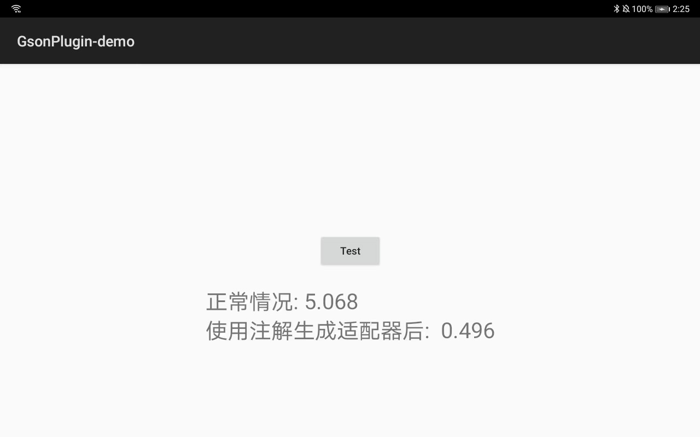

# gson_plugin
gson_plugin是一个注解处理器，能够在编译期自动生成**兼容Kotlin特性的**、**高性能TypeAdapter**，以提升Gson的序列化与反序列化时间性能。同时也解决了kotlin默认值的问题
1. 目前测试支持kotlin 最高版本1.7.20
2. 支持gson和Moshi生成的adapter冲突
3. 支持gson自定义基本类型解析被阻断无效的场景(比如自定义BoolTypeAdapter)
4. 支持嵌套内部类,嵌套内部类名字用下划线隔离,避免不同类的嵌套类名字冲突
5. [即将支持] 模型参数没有默认值的情况 (目前必须写默认值, 可以是?=null的形式)
6. 支持别名  @SerializedName("age", alternate = ["age_int","AGE"])
7. 支持模型实现其他接口,比如Serializable等
8. 支持枚举类自动生成TypeAdapter @AutoGeneratedJsonAdapter (目前仅限kapt ksp还没完成)
9. 支持枚举序列化为String,Int,Long等类型(gson 默认会序列化成字符串类型 比如"1" 而不是1)
10. 自动生成的适配器 支持继承,业务可以继承了 然后再塞给gson
11. [即将支持] 对于整型枚举 用SparseArray替代hashmap 提高查询和节省内存


### 注解解释
```kotlin
annotation class AutoGeneratedJsonAdapter(
    /**
     * 是否是空安全 默认true
     *
     * 如,对于int类型的声明
     * 如果是val i:Int? 将不受任何影响
     * 如果是val i:Int json里面是null 那么设置为false 将会报错,否则将会跳过这个字段
     *
     * 受影响范围 [INT, LONG, FLOAT, DOUBLE, STRING, BOOLEAN,ENUM]
     */
    val nullSafe: Boolean = true,
    /**
     * 是否强类型匹配 默认false
     *
     * 如,对于int类型的声明
     *如果是val i:Int? 将不受任何影响
     * 如果是val i:Int json里面是"" 那么设置为true 将会报错,否则继续调用gson.getAdapter 继续责任链解析(交给gson自带的或者registerTypeAdapter等来解析)
     *
     * 受影响范围 [INT, LONG, FLOAT, DOUBLE, STRING, BOOLEAN,ENUM]
     */
    val strictType: Boolean = false,

    /**
     * 生成的adapter文件 后缀名字 默认“AutoGeneratedTypeAdapter”
     */
    val adapterNameSuffix: String = "AutoGeneratedTypeAdapter",

    /**
     * 序列化枚举的时候生效
     * 最终序列化的类型,Gson对于枚举默认序列化成String类型
     * 默认 SerializedType.STRING
     */
    val serializedType: SerializedType = SerializedType.STRING,
)

```
### 仓库权限
```groovy
//请在build.gradle中配置
allprojects {
    repositories {

        maven {
            url 'https://maven.aliyun.com/repository/public'
        }
        maven {
            credentials {
                username '654f4d888f25556ebb4ed790'
                password 'OsVOuR6WZFK='
            }
            url 'https://packages.aliyun.com/maven/repository/2433389-release-RMv0jP/'
        }
        maven {
            credentials {
                username '654f4d888f25556ebb4ed790'
                password 'OsVOuR6WZFK='
            }
            url 'https://packages.aliyun.com/maven/repository/2433389-snapshot-Kqt8ID/'
        }
    }
    configurations.all {
        // 实时检查 Snapshot 更新
        resolutionStrategy.cacheChangingModulesFor 0, 'seconds'
    }
}
```

### Download
<details open>
  <summary>Gradle</summary>

```groovy
plugins {
    id 'kotlin-kapt'
}

dependencies {
    implementation("com.NBXXF.gson_plugin:lib_gson_annotation:1.2.0-SNAPSHOT")
    kapt("com.NBXXF.gson_plugin:lib_gson_plugin_kapt:1.2.0-SNAPSHOT")
}

kapt {
    arguments {
        // 指定生成TypeAdapterFactory的全限定名，不指定则不生成
        arg("factory", "com.xxf.json.gson.plugin.AutoTypeAdapterFactory")
    }
}
```
</details>

<details close>
  <summary>Kotlin-DSL</summary>

```kotlin
plugins {
    kotlin("kapt")
}

dependencies {
    implementation("com.NBXXF.gson_plugin:lib_gson_annotation:1.2.0-SNAPSHOT")
    kapt("com.NBXXF.gson_plugin:lib_gson_plugin_kapt:1.2.0-SNAPSHOT")
}

kapt {
    arguments {
        // 指定生成TypeAdapterFactory的全限定名，不指定则不生成
        arg("factory", "com.xxf.json.gson.plugin.AutoTypeAdapterFactory")
    }
}
```
</details>

### Usage

```kotlin
// 增加注解
@AutoGeneratedJsonAdapter
data class Foo(
    val string: String = ""
)

// 将生成的TypeAdapterFactory注册到gson实例中
val gson = GsonBuilder()
    .registerTypeAdapterFactory(AutoTypeAdapterFactory())
    .create()
```

### 平均五倍以上的提速 比moshi 自动生成adapter 更快



### KSP-Support
[KSP(Kotlin Symbol Processing)](https://github.com/google/ksp)是Google推出的更高性能、源码级的注解处理器，gson_plugin也对KSP作了支持。

<details open>
  <summary>Gradle</summary>

根目录build.gradle

```groovy
plugins {
    id('com.google.devtools.ksp') version "$kotlin_version-1.0.0"
}
```

app模块build.gradle

```groovy
plugins {
    id('com.google.devtools.ksp')
}

android {
    // KSP生成的代码不能被IDE自动识别到，需要手动添加到sourceSets中
    buildTypes {
        debug {
            sourceSets.main {
                java.srcDir("build/generated/ksp/debug/kotlin")
            }
        }
        release {
            sourceSets.main {
                java.srcDir("build/generated/ksp/release/kotlin")
            }
        }
    }
}

dependencies {
    implementation('com.NBXXF.gson_plugin:lib_gson_annotation:1.2.0-SNAPSHOT')
    ksp('com.NBXXF.gson_plugin:lib_gson_plugin_ksp:1.2.0-SNAPSHOT')
}

ksp {
    // 指定生成TypeAdapterFactory的全限定名，不指定则不生成
    arg("factory", "com.xxf.json.gson.plugin.AutoTypeAdapterFactory")
}
```

</details>

<details close>
  <summary>Kotlin DSL</summary>

根目录下的build.gradle

```kotlin
plugins {
    kotlin("jvm")
    id("com.google.devtools.ksp") version "$kotlin_version-1.0.0"
}
```

app模块build.gradle

```kotlin
plugins {
    id("com.google.devtools.ksp")
}

android {
    // KSP生成的代码不能被IDE自动识别到，需要手动添加到sourceSets中
    buildTypes {
        getByName("debug") {
            sourceSets.getByName("main") {
                java.srcDir("build/generated/ksp/debug/kotlin")
            }
        }
        getByName("release") {
            sourceSets.getByName("main") {
                java.srcDir("build/generated/ksp/release/kotlin")
            }
        }
    }
}

dependencies {
    implementation('com.NBXXF.gson_plugin:lib_gson_annotation:1.2.0-SNAPSHOT')
    ksp('com.NBXXF.gson_plugin:lib_gson_plugin_ksp:1.2.0-SNAPSHOT')
}

ksp {
    // 指定生成TypeAdapterFactory的全限定名，不指定则不生成
    arg("factory", "com.xxf.json.gson.plugin.AutoTypeAdapterFactory")
}
```
</details>

